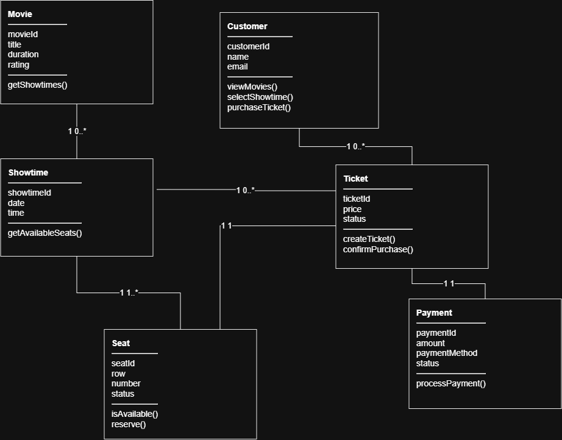
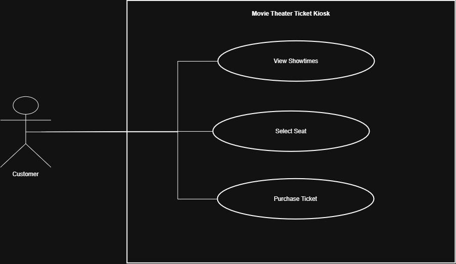
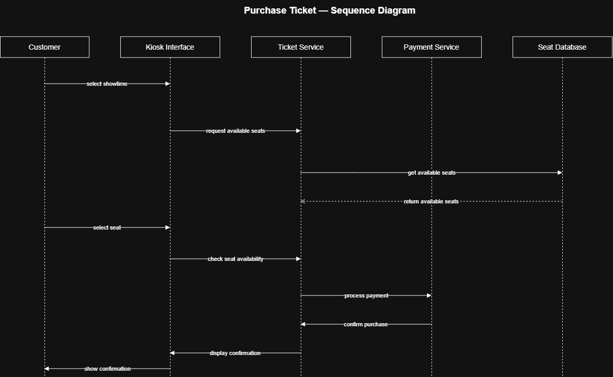

# Movie Theater Ticket Kiosk

## Overview

The Movie Theater Ticket Kiosk is a self-service system that allows customers to view available movies and showtimes, choose an available seat, and purchase a movie ticket. The system provides purchase confirmation and must prevent the same seat from being sold twice.

---

## Kiosk Requirements

1. A customer can view available movies and showtimes.
2. A customer can choose an available seat.
3. A customer can purchase a ticket.
4. The system provides a confirmation after a successful purchase.
5. The system prevents the same seat from being sold twice.

---

## UML Diagrams

The editable diagrams and PNG exports are available in the [`diagrams/`](./diagrams/) folder.

### Domain Model

The domain model represents the main concepts involved in the Movie Theater Ticket Kiosk and their relationships.

**Files:**
- [Domain Model – Editable](./diagrams/Movie-Kiosk-Domain-Model.drawio)
- [Domain Model – PNG](./diagrams/Movie-Kiosk-Domain-Model.png)



---

### Use-Case Diagram

The use-case diagram identifies the **Customer** as the primary actor and shows the main user goals supported by the Movie Theater Ticket Kiosk.

**Use Cases:**
- View Showtimes
- Select Seat
- Purchase Ticket

**Files:**
- [Use-Case Diagram – Editable](./diagrams/Movie-Kiosk-Use-Case.drawio)
- [Use-Case Diagram – PNG](./diagrams/Movie-Kiosk-Use-Case.png)



---

## Expanded Use Case — Purchase Ticket

### Primary Actor

**Customer**

### Precondition

The customer has selected an available movie/showtime and an available seat.

### Main Steps

1. Customer selects a movie showtime.
2. The kiosk displays the available seats.
3. Customer selects an available seat.
4. The kiosk requests the ticket purchase.
5. The system verifies that the selected seat is still available.
6. The system processes the payment.
7. The kiosk confirms the purchase and provides the ticket confirmation.

### Postcondition

The ticket purchase is confirmed and the selected seat is no longer available for another purchase.

---

## Sequence Diagram — Purchase Ticket

The sequence diagram shows the interaction between the customer, kiosk interface, ticket service, payment service, and seat database during the ticket-purchase process.

**Participants:**
- Customer
- Kiosk Interface
- Ticket Service
- Payment Service
- Seat Database

**Files:**
- [Sequence Diagram – Editable](./diagrams/Purchase-Ticket-Sequence.drawio)
- [Sequence Diagram – PNG](./diagrams/Purchase-Ticket-Sequence.png)



---

## Repository Structure

```text
HW1-Movie-Kiosk/
│
├── README.md
├── requirements.md
│
└── diagrams/
    ├── Movie-Kiosk-Domain-Model.drawio
    ├── Movie-Kiosk-Domain-Model.png
    ├── Movie-Kiosk-Use-Case.drawio
    ├── Movie-Kiosk-Use-Case.png
    ├── Purchase-Ticket-Sequence.drawio
    └── Purchase-Ticket-Sequence.png
